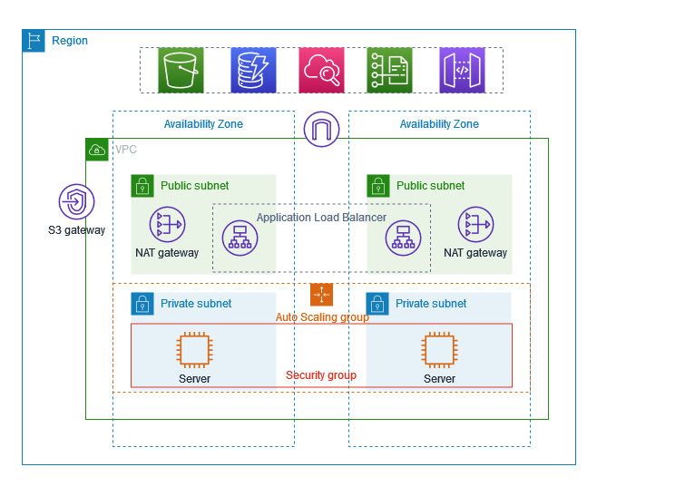
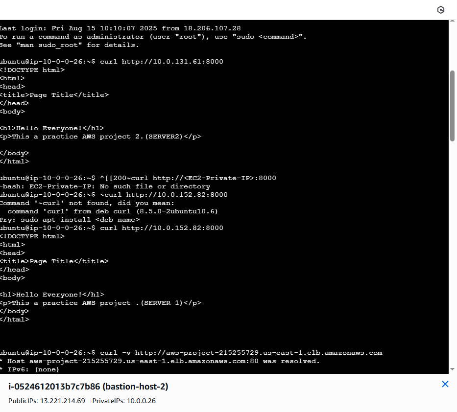

# 🚀 AWS Project – Deploying a Python App with EC2, Load Balancer, and Auto Scaling  

This project demonstrates deploying a **Python web application** on **AWS EC2 instances** across multiple Availability Zones, exposing it using an **Application Load Balancer (ALB)**, and scaling it with an **Auto Scaling Group**.  

The goal is to showcase **high availability, scalability, and fault tolerance** in AWS cloud deployments.  

---

## 📌 Project Architecture  



### Key Components  
- **VPC** with public and private subnets spread across **two Availability Zones**.  
- **EC2 Instances** running a simple Python web app (each displaying a different caption).  
- **Auto Scaling Group** to maintain availability and handle scaling.  
- **Application Load Balancer (ALB)** to distribute incoming traffic.  
- **NAT Gateway** for outbound internet access.  
- **S3 Gateway** for storage connectivity.  
- **Security Groups** to control inbound/outbound traffic.  

---

## 📌 Application  

The deployed Python app serves different content depending on which EC2 instance handles the request:  

- **Server 1 Output:**  
```html
<h1>Hello Everyone!</h1>
<p>This is a practice AWS project 1 (SERVER 1)</p>

- **Server 2 Output:** 
<h1>Hello Everyone!</h1>
<p>This is a practice AWS project 2 (SERVER 2)</p>

📌 Testing the Setup
1️⃣ Access via Load Balancer

Requests to the ALB DNS endpoint are distributed between the two servers:

This confirms that the Load Balancer is routing traffic across multiple EC2 instances.

2️⃣ Accessing Instances Directly

I also tested the application using the private IPs of each instance:

10.0.131.61:8000 → SERVER 2

10.0.152.82:8000 → SERVER 1

This validates that both servers are running the application independently.

📌 Concepts Demonstrated

✔️ High Availability – Multiple EC2 instances across Availability Zones.
✔️ Scalability – Auto Scaling Group adjusts capacity as needed.
✔️ Load Balancing – ALB evenly distributes requests.
✔️ Security – Controlled traffic via Security Groups & NAT Gateways.
✔️ Resilience – Fault-tolerant design ensures uptime.

📌 Conclusion

Through this project, I learned how to:

Deploy applications on AWS EC2.

Use Application Load Balancers for traffic distribution.

Implement Auto Scaling Groups for scaling workloads.

Build a fault-tolerant architecture across multiple Availability Zones.

This setup can be extended further with RDS for databases, CloudFront for content delivery, or ECS/EKS for containerization.

✨ This project highlights my hands-on AWS cloud skills in deploying scalable, secure, and highly available applications.



